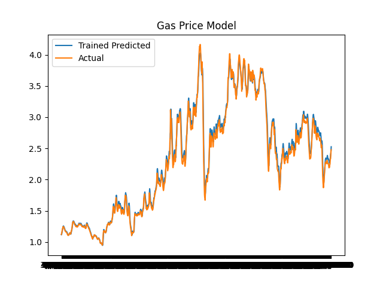

# LSTM

A program to train models using a Long-Short-Term-Memory RNN. Useful for creating models for time series data such as product prices, weather temperature, cancer incidences etc. The current archetecture of the network goes as follows: \
Input -> LSTM(50) -> LSTM(100) -> LSTM(200) -> LSTM(400) -> LSTM(200) -> LSTM(100) -> Dense(1).

